# codbex-portunus

e-Commerce Backoffice Management

- [Demo instance](#demo-instance)
- [Build and Run](#build-and-run)
- [Architecture](#architecture)
	- [Design overview](#design-overview)
	- [DB Model](#db-model)
- [User interface](#user-interface)

## Demo instance
You can try the Portunus [here](https://dev.portunus.eu1.codbex.com). 
It is conifgured to use a [demo OpenCart instance](https://dev.opencart-demo.eu1.codbex.com).

## Build and Run

### Prerequisites
The following Eclipse Dirigible configurations should be available:

| Name | Example value |
|--|--|
| DIRIGIBLE_HOME_URL | /services/web/codbex-portunus/gen/index.html |
| PORTUNUS_OPENCART_DB_HOST | localhost |
| PORTUNUS_OPENCART_DB_PORT | 3306 |
| PORTUNUS_OPENCART_DB_NAME | bitnami_opencart |
| PORTUNUS_OPENCART_DB_USER | bn_opencart |
| PORTUNUS_OPENCART_DB_PASS | mypass |

[Here](https://www.dirigible.io/help/setup/setup-environment-variables/) is described how you can provide dirigbile configurations.

### Steps
To deploy and run the Portunus, you have to follow the steps described bellow.
- Get [Eclipse Dirigible](https://github.com/eclipse/dirigible) up and running by following the steps described in [here](https://github.com/eclipse/dirigible?tab=readme-ov-file#get-started)
- Clone the Portunus project `https://github.com/codbex/codbex-portunus.git` using the git perspective.
    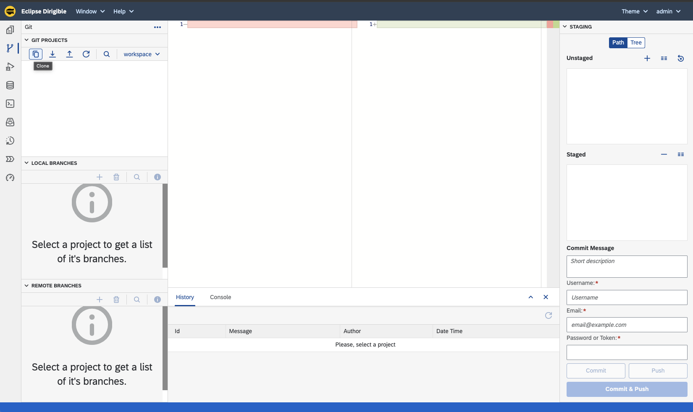
    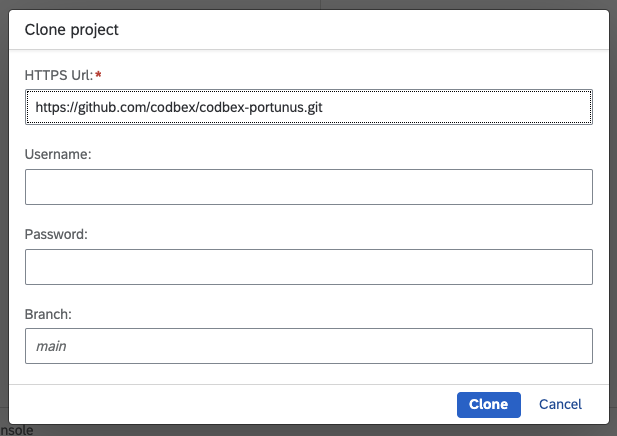

- Publish the Portunus project
    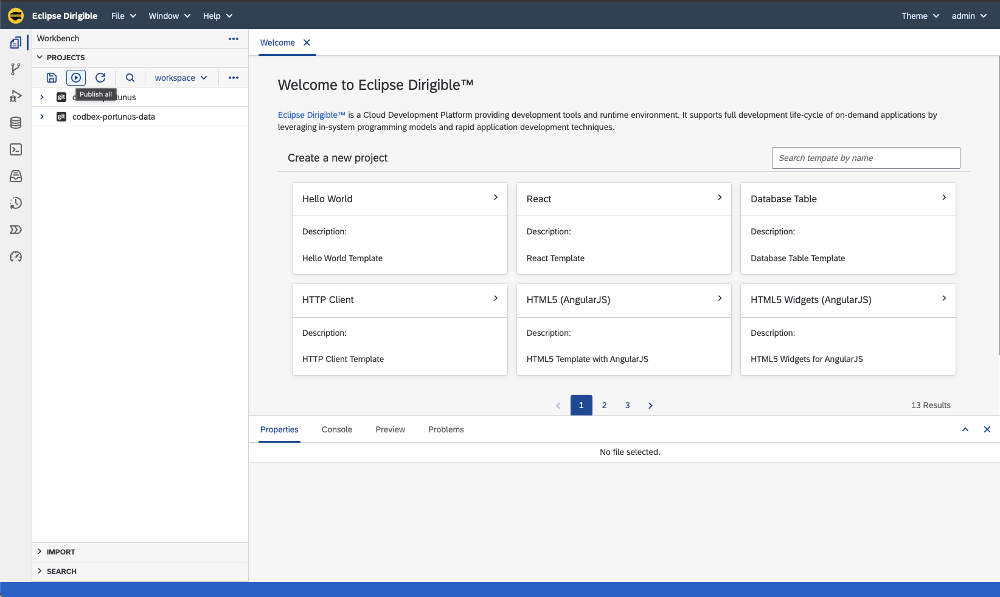

- After a few seconds, the Portunus should be available on the following path `/services/web/codbex-portunus/gen/index.html`. If the Dirigible is hosted on `localhost`, the URL will be  [http://localhost:8080/services/web/codbex-portunus/gen/index.html](http://localhost:8080/services/web/codbex-portunus/gen/index.html)

## Architecture

### Design overview

### DB Model
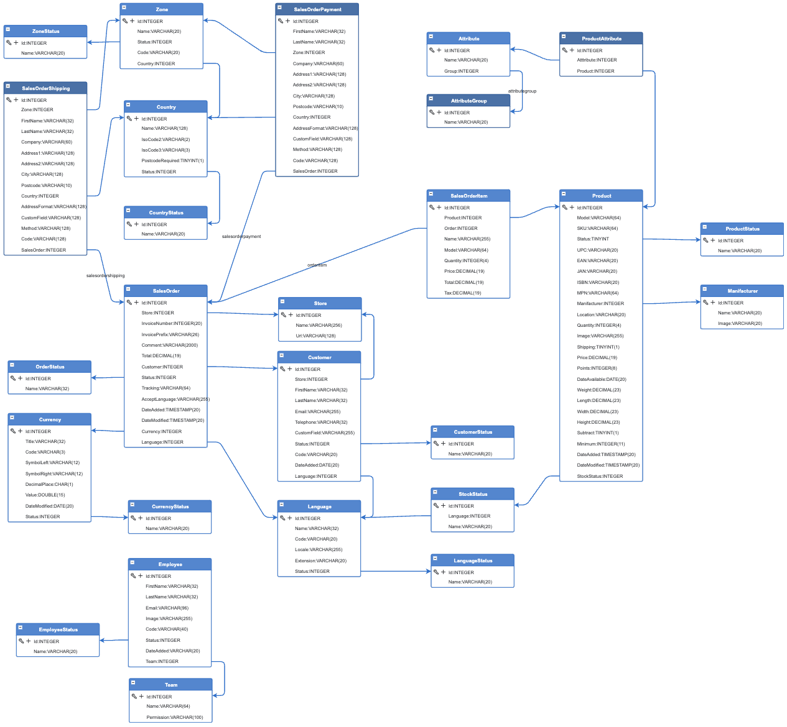

## User interface

### Launchpad
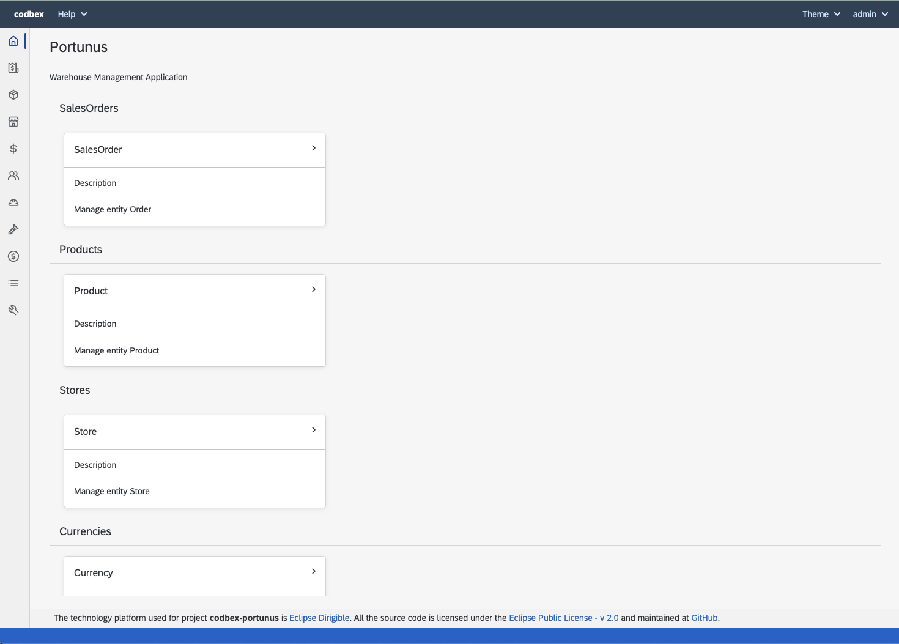

### Management

#### Sales Orders
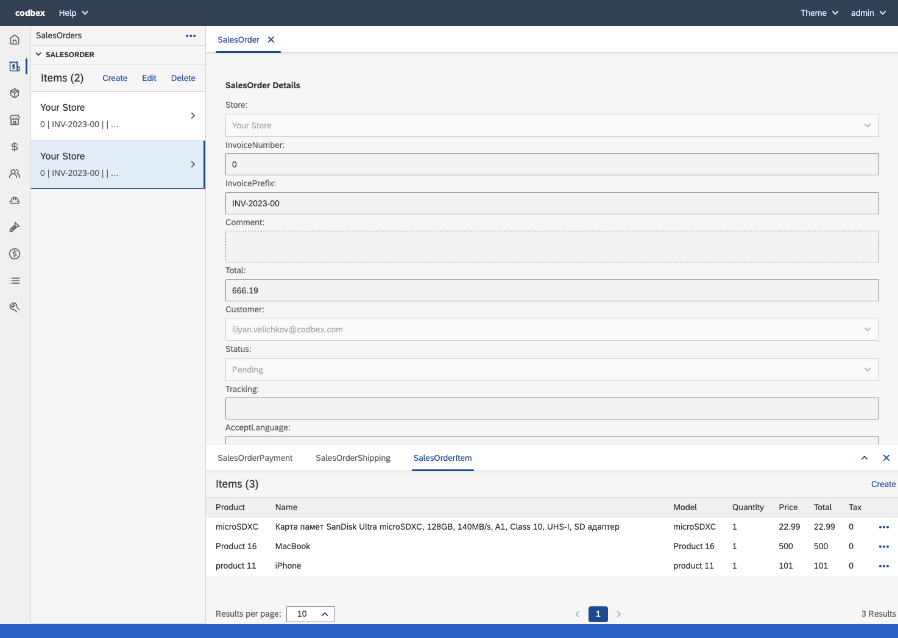

#### Products
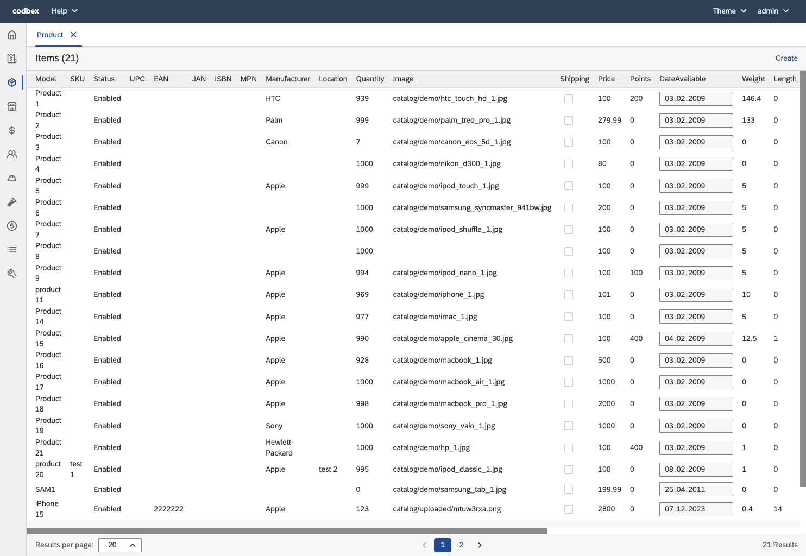

#### Stores
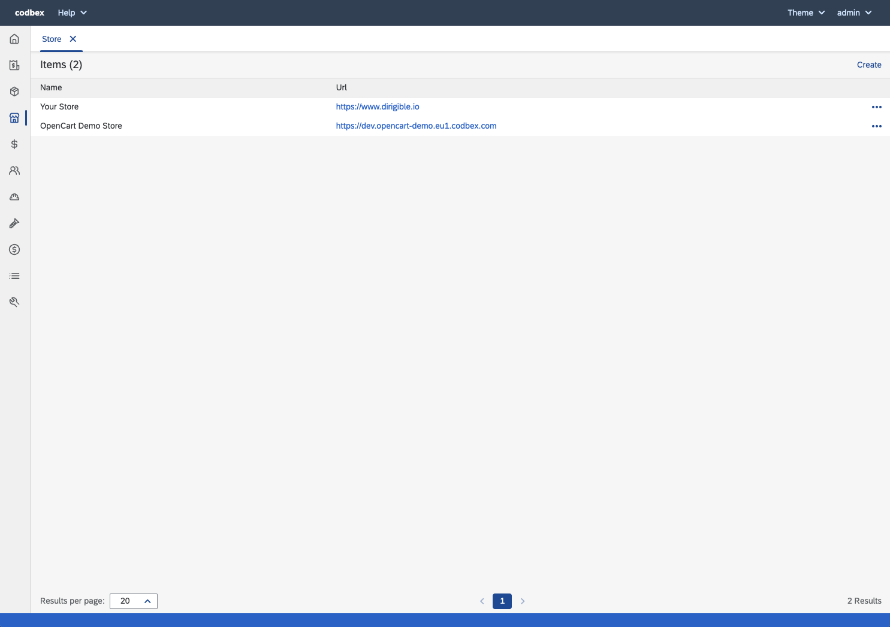

#### Currencies
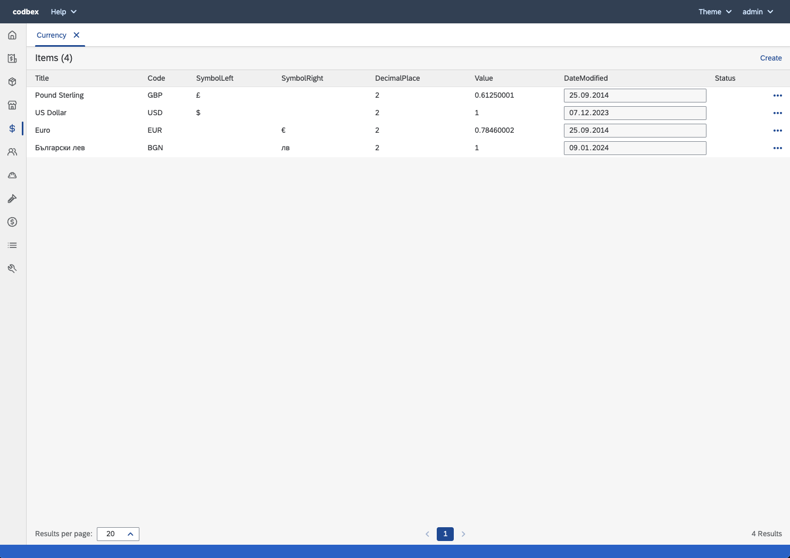

#### Employee Groups

#### Employees
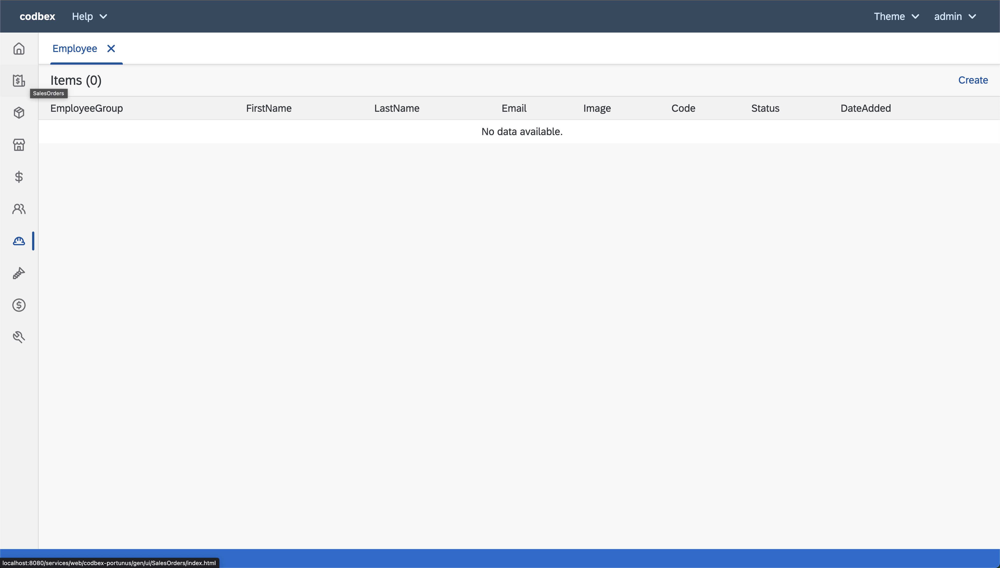

#### Manufacturers
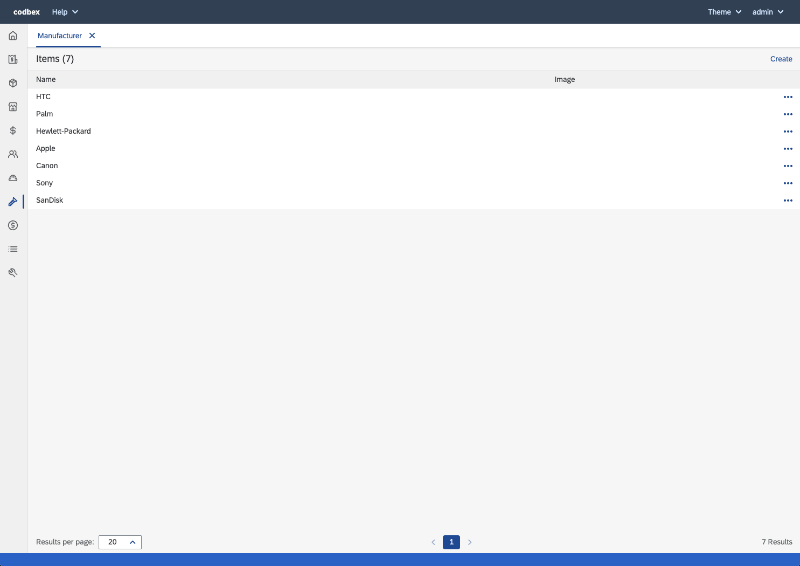

#### Customers/Affiliates
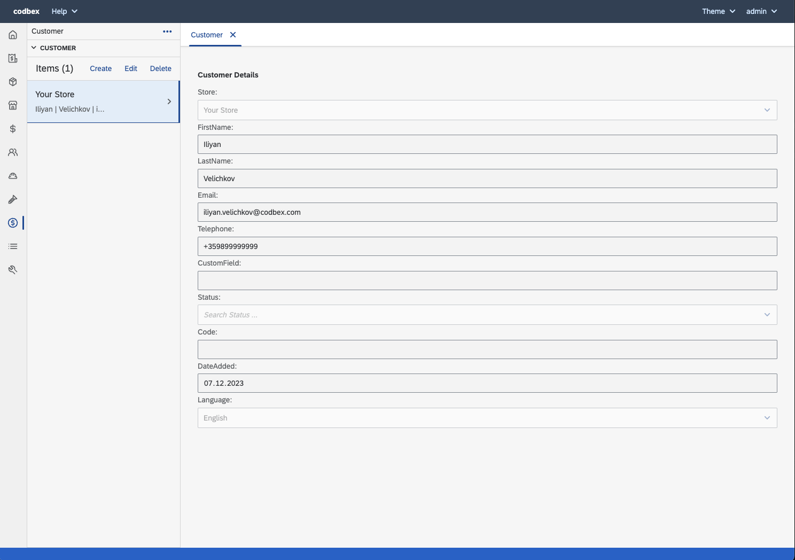

#### Attributes
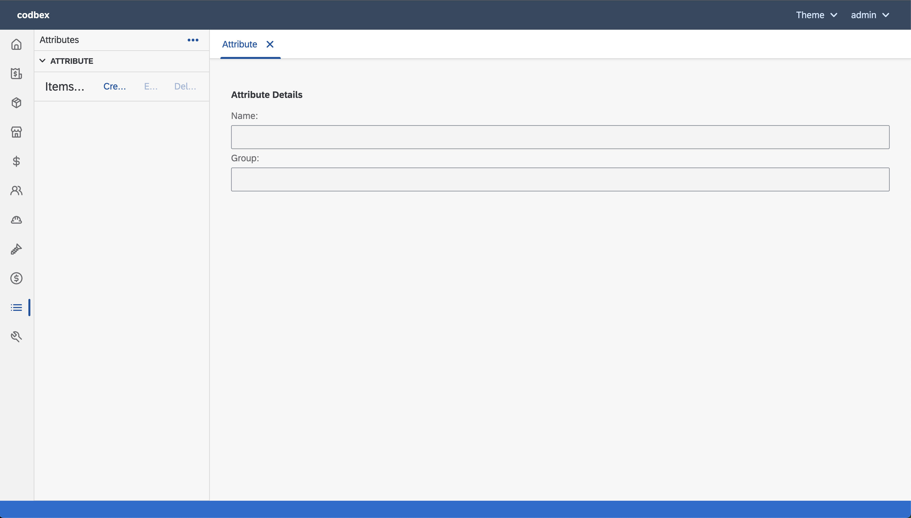

#### Settings
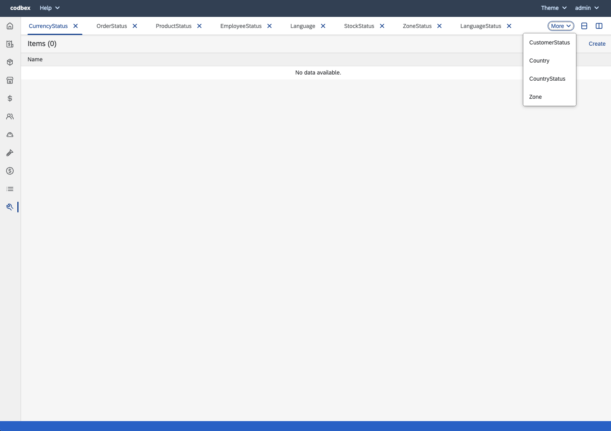
