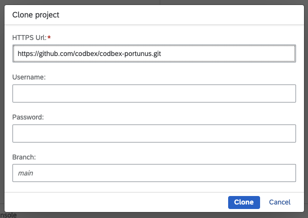
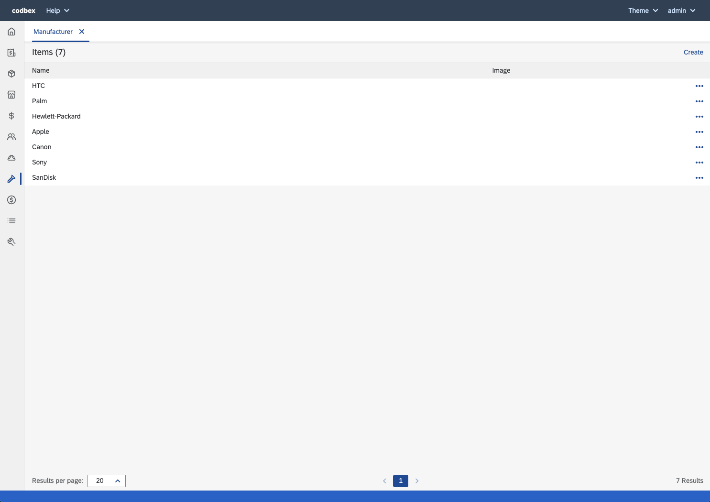

# codbex-portunus

e-Commerce Backoffice Management

- [Build and Run](#build-and-run)
- [Architecture](#architecture)
	- [Design overview](#design-overview)
	- [DB Model](#db-model)
- [User interface](#user-interface)

## Build and Run

### Prerequisites
The following Dirigible configurations should be available:

| Name | Example value |
|--|--|
| PORTUNUS_OPENCART_DB_HOST | localhost |
| PORTUNUS_OPENCART_DB_PORT | 3306 |
| PORTUNUS_OPENCART_DB_NAME | bitnami_opencart |
| PORTUNUS_OPENCART_DB_USER | bn_opencart |
| PORTUNUS_OPENCART_DB_PASS | mypass |

[Here](https://www.dirigible.io/help/setup/setup-environment-variables/) is described how you can provide dirigbile configurations.

### Steps
To deploy and run the Portunus, you have to follow the steps described bellow.
- Get Eclipse Dirigible up and running by following the steps described in [here](https://github.com/eclipse/dirigible?tab=readme-ov-file#get-started)
- Clone the Portunus project using the git perspective
    
    

- Publish the Portunus project
    

- After a few seconds, the Portunus should be available on the following path `/services/web/codbex-portunus/gen/index.html`. If the Dirigible is hosted on `localhost`, the URL will be  [http://localhost:8080/services/web/codbex-portunus/gen/index.html](http://localhost:8080/services/web/codbex-portunus/gen/index.html)

## Architecture

### Design overview

### DB Model

## User interface

### Launchpad

### Management

#### Sales Orders

#### Products

#### Stores

#### Currencies

#### Employee Groups

#### Employees

#### Manufacturers

#### Customers/Affiliates

#### Attributes

#### Settings

