# codbex-portunus
Warehouse Management

## Run
The following Dirigible conifgurations should be available:

| Name | Example value |
|--|--|
| PORTUNUS_OPENCART_DB_HOST | localhost |
| PORTUNUS_OPENCART_DB_PORT | 3306 |
| PORTUNUS_OPENCART_DB_NAME | bitnami_opencart |
| PORTUNUS_OPENCART_DB_USER | bn_opencart |
| PORTUNUS_OPENCART_DB_PASS | mypass |
[Here](https://www.dirigible.io/help/setup/setup-environment-variables/) is described how you can provide dirigbile configurations.

## Model

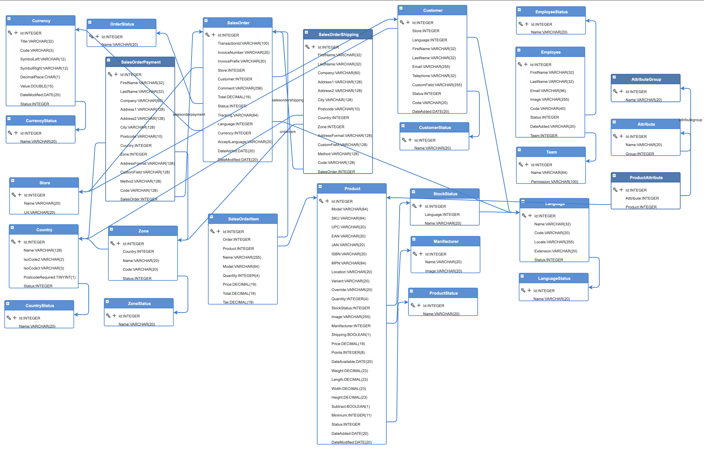

## Desing

### Application 

#### Launchapd

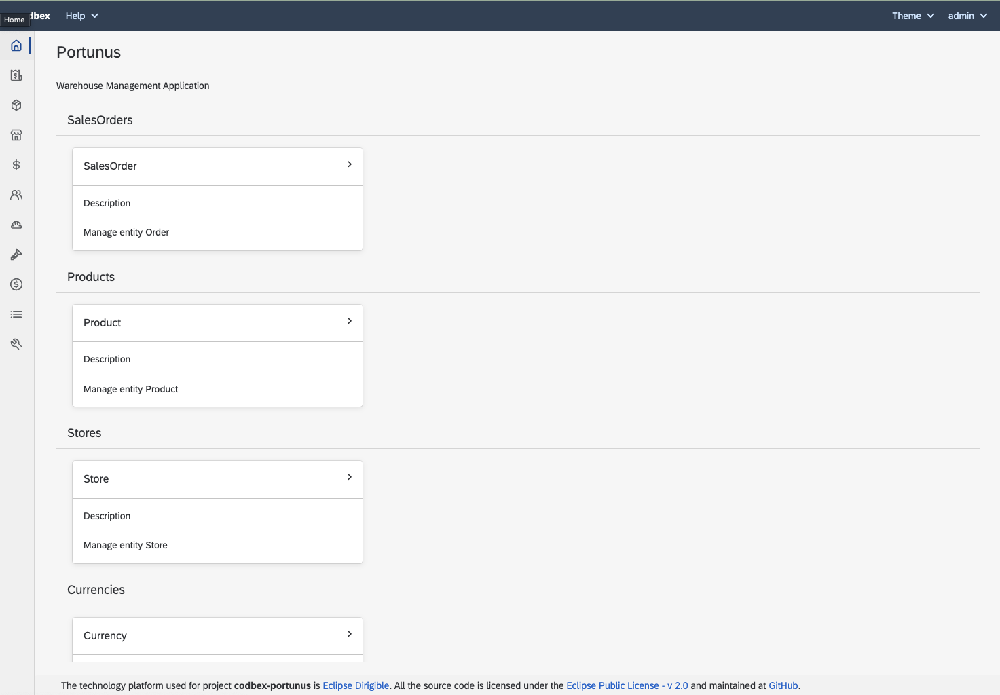

#### Management

##### Sales Orders

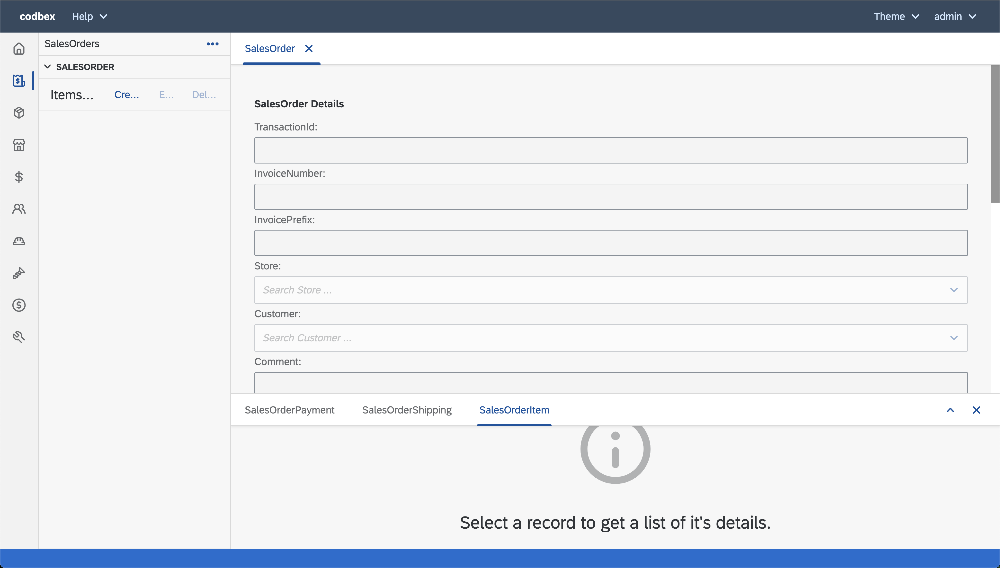

##### Products

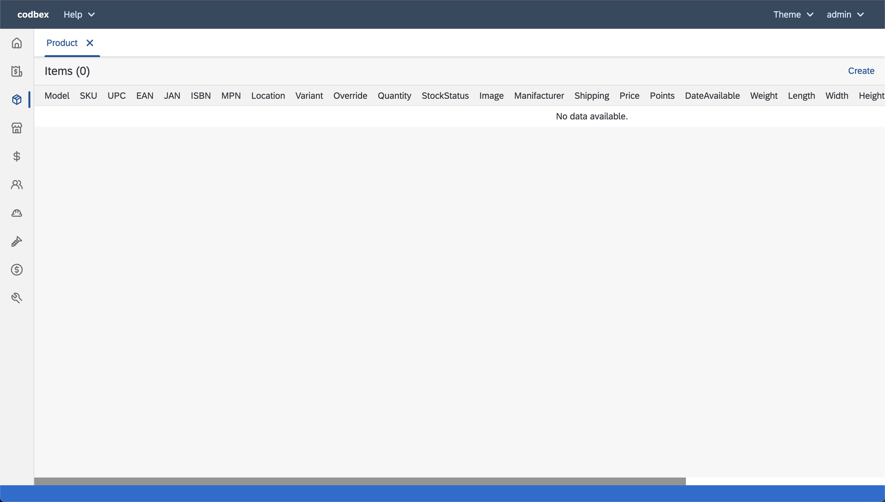

##### Stores

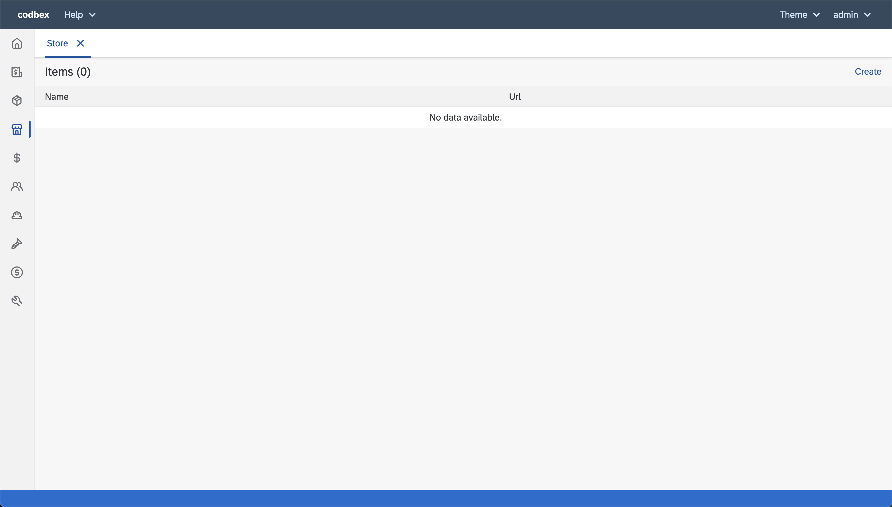

##### Currencies

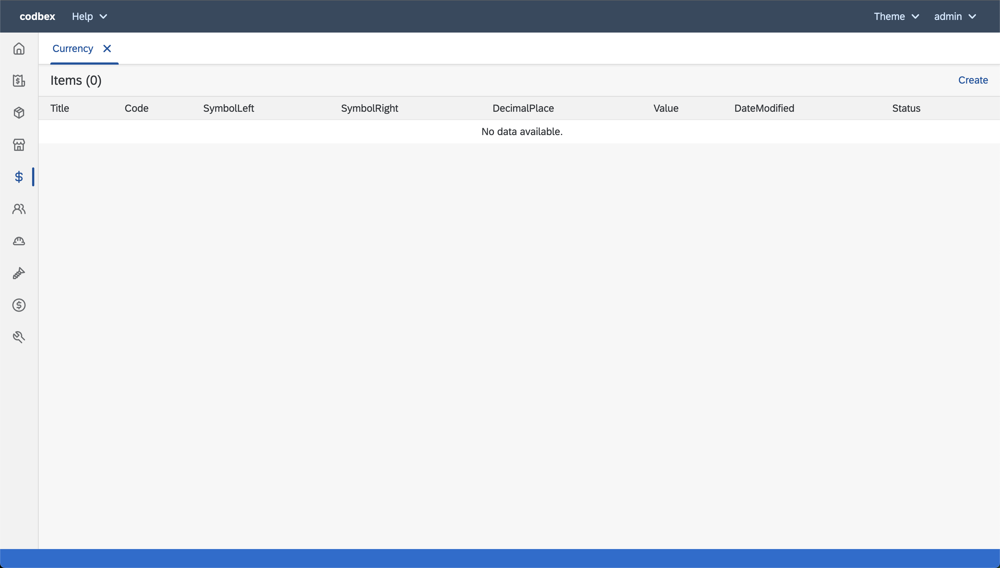

##### Employee Groups

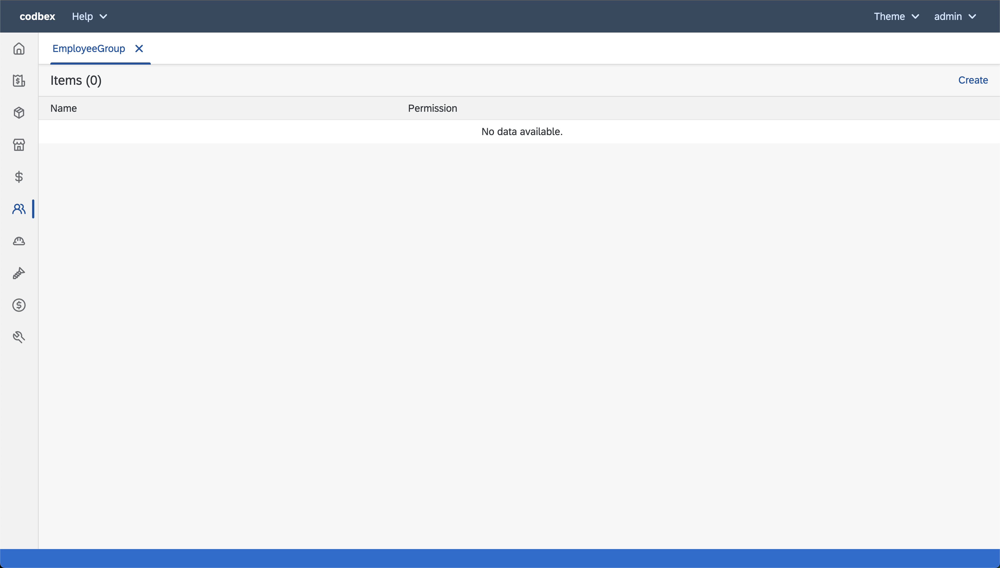

##### Employees

##### Manifacturers

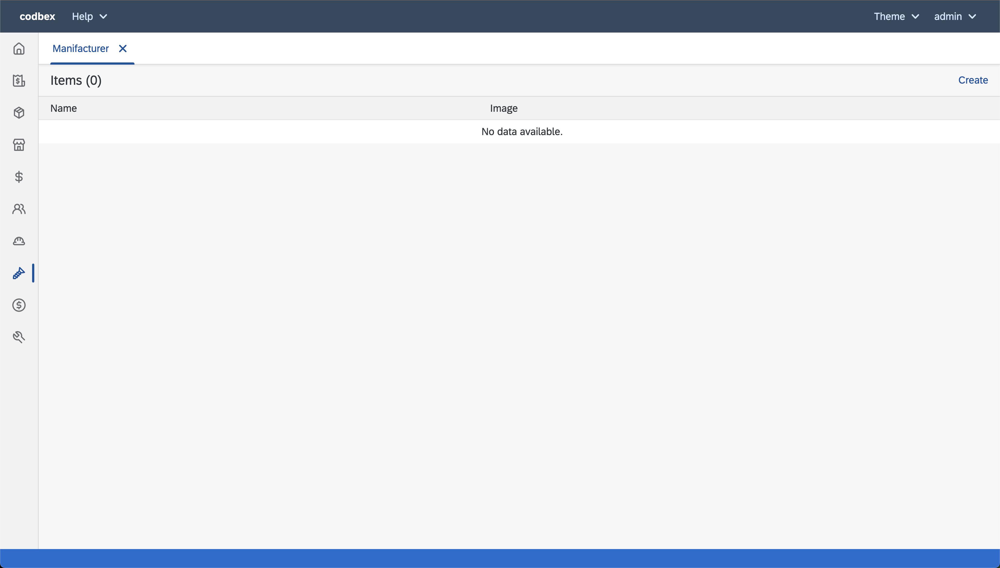

##### Customers/Affiliates

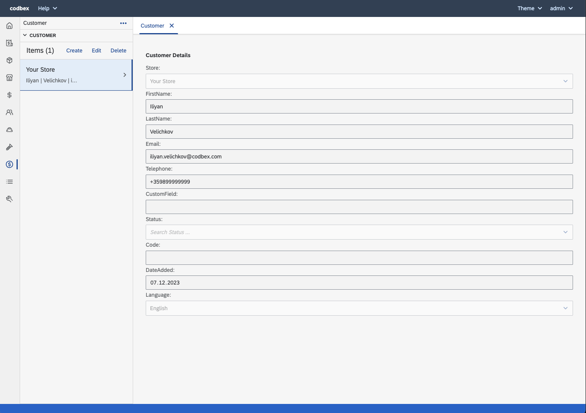

##### Attributes

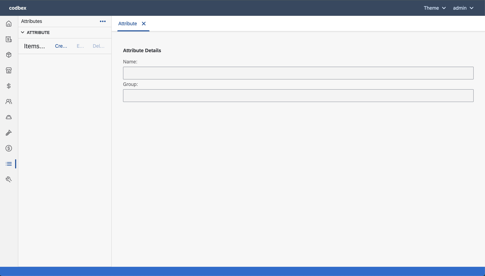

##### Settings

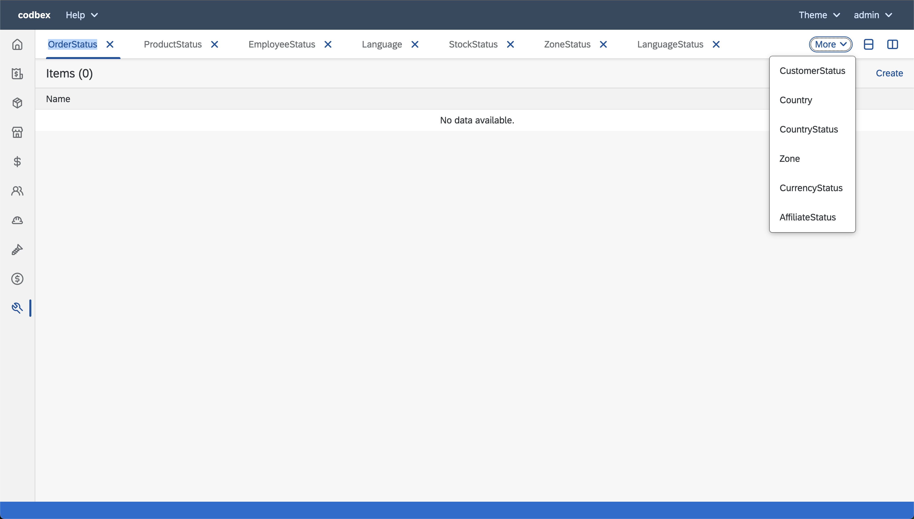
