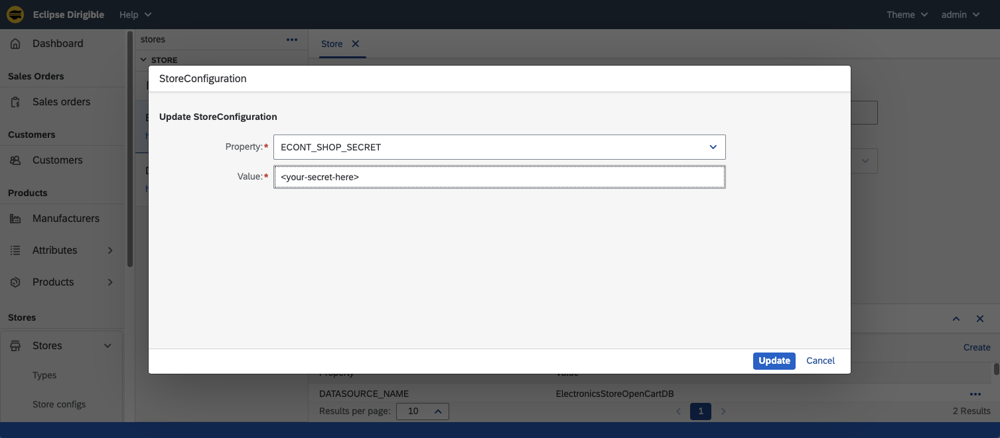
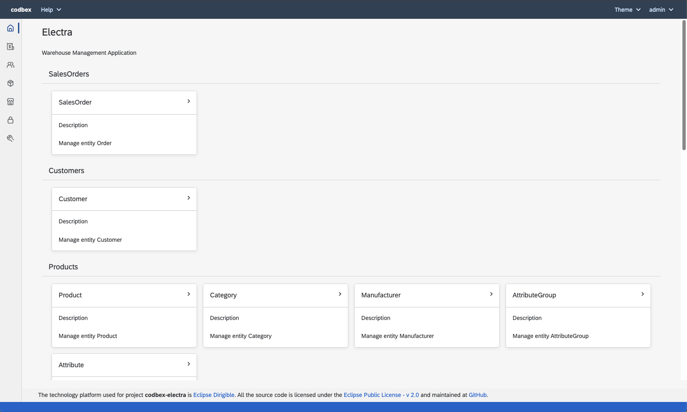
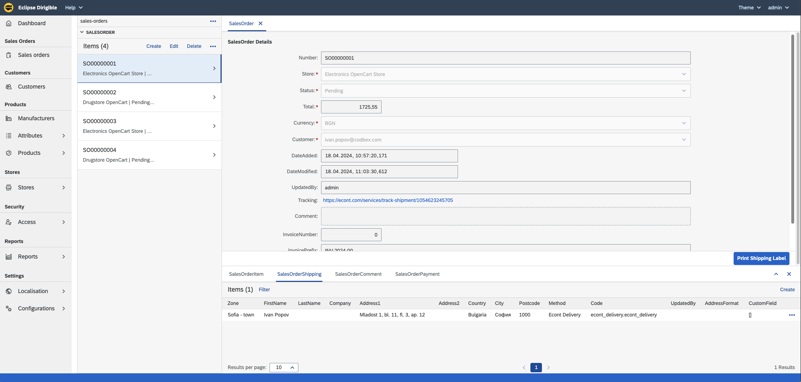
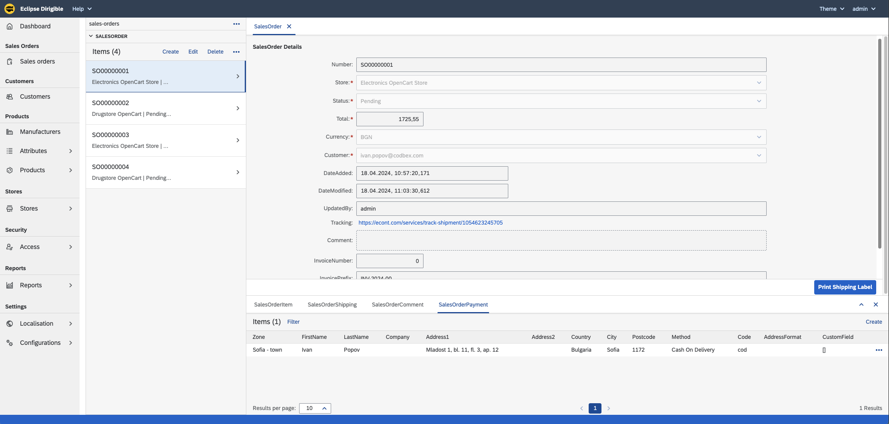
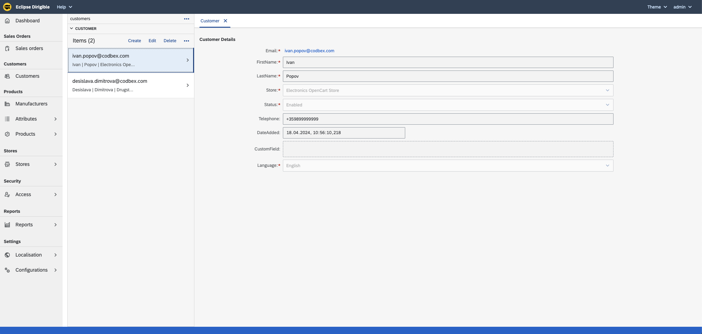
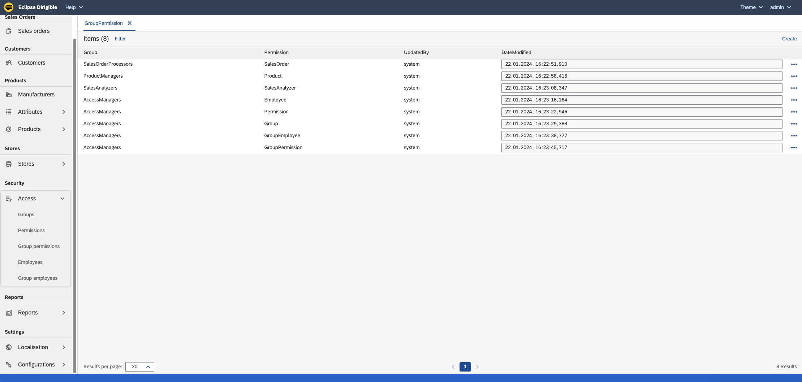
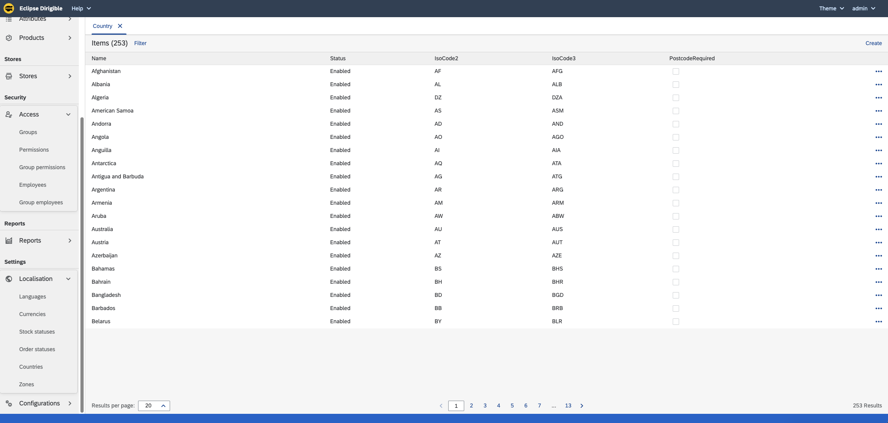
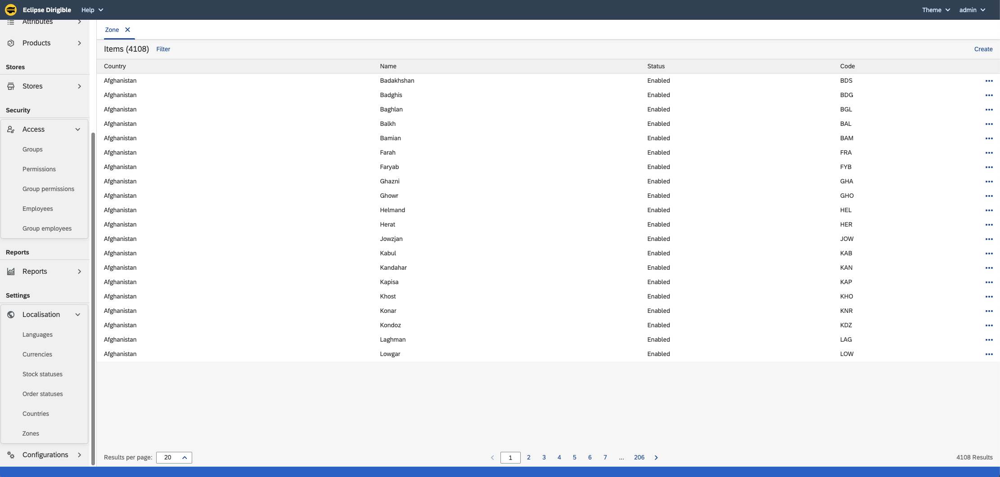
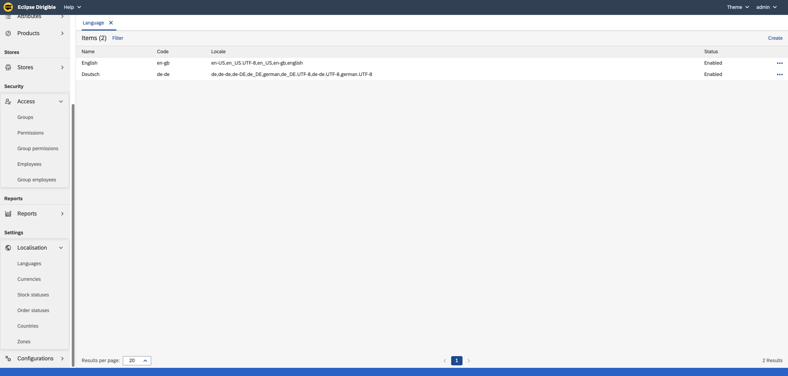
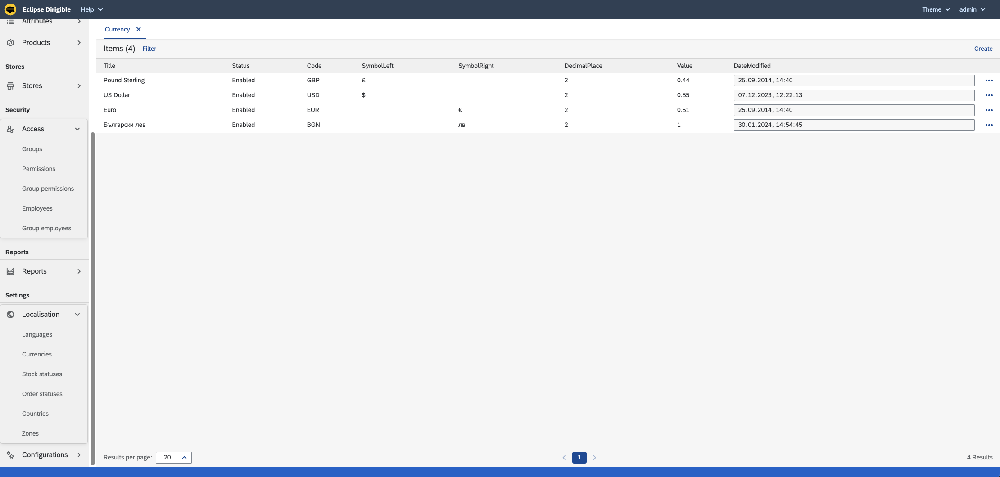

# codbex-electra

e-Commerce Backoffice Management

- [Demo instance](#demo-instance)
- [Build and Run](#build-and-run)
- [Architecture](#architecture)
	- [Design overview](#design-overview)
	- [DB Model](#db-model)
    - [Data synchronization](#data-synchronization)
        - [Inbound synchronization](#inbound-synchronization---data-replication-from-opencart-to-electra)
        - [Outbound synchronization](#outbound-synchronization---data-replication-from-electra-to-opencart)
- [User interface](#user-interface)

## Demo instance
THIS SECTION IS **UNDER MAINTENANCE!**

## Build and Run

### Prerequisites
The following Eclipse Dirigible configurations should be available:

| Name | Description | Example value |
|--|--|--|
| DIRIGIBLE_HOME_URL | Electra home URL | /services/web/codbex-electra/gen/index.html |
| ELECTRA_ECONT_DELIVERY_URL | URL of the deliver with econt | https://delivery.econt.com |

[Here](https://www.dirigible.io/help/setup/setup-environment-variables/) is described how you can provide Dirigible configurations.

### Steps
To deploy and run the Electra, you have to follow the steps described bellow.
- Get [Eclipse Dirigible](https://github.com/eclipse/dirigible) up and running by following the steps described in [here](https://github.com/eclipse/dirigible?tab=readme-ov-file#get-started)
- Clone the Electra project `https://github.com/codbex/codbex-electra.git` using the git perspective.

    

    

- Publish the Electra project

    

- After a few seconds, the Electra should be available on the following path `/services/web/codbex-electra/gen/index.html`. If the Dirigible is hosted on `localhost`, the URL will be  [http://localhost:8080/services/web/codbex-electra/gen/index.html](http://localhost:8080/services/web/codbex-electra/gen/index.html)

- To configure a new OpenCart store you have to
    - Create a new Store entry
    - Create new `.datasource` file
    - Add store configurations via UI for
        - store datasource
        - econt shop secret <br>
          
- You can use the configured Electra demo stores. To configure them, follow the steps bellow
    - Configure corresponding data sources using the predefined env variables
        ```
            export ELECTRA_ELECTRONICS_STORE_DB_HOST='localhost'
            export ELECTRA_ELECTRONICS_STORE_DB_PORT='3001'
            export ELECTRA_ELECTRONICS_STORE_DB_NAME='bitnami_opencart'
            export ELECTRA_ELECTRONICS_STORE_DB_USER='bn_opencart'
            export ELECTRA_ELECTRONICS_STORE_DB_PASS='<db_pass>'

            export ELECTRA_DRUGSTORE_DB_HOST='localhost'
            export ELECTRA_DRUGSTORE_DB_PORT='3002'
            export ELECTRA_DRUGSTORE_DB_NAME='bitnami_opencart'
            export ELECTRA_DRUGSTORE_DB_USER='bn_opencart'
            export ELECTRA_DRUGSTORE_DB_PASS='<db_pass>'
        ```
    - Configure econt shop secrets from the Electra UI
       
    - To enable the synchronization between Electra and OpenCart, stores must be enabled from the UI. Only the enabled stores are part of the synchronization.
        

**Note:** you can use the configured OpenCart dev systems which are described [here](https://github.com/codbex/awesome-stuff/blob/main/opencart/README.md#dev-systems)

## Architecture

### Design overview

---
### DB Model

---
### Data synchronization

#### Inbound synchronization - data replication from OpenCart to Electra
Since OpenCart UI is used by the shop customers to purchase goods and create accounts, we have to replicate data from OpenCart to Electra DB. This is done by inbound synchronizers implemented as `*.camel` files which are located [here](codbex-electra-opencart/synch/inbound/).<br>

In the following table you can find more details about the tables mapping.

| OpenCart Table | Electra Table | Synch frequency | cron |
|--|--|--|--|
| oc_customer | CODBEX_CUSTOMER | every minute | `10 * * ? * *` |
| oc_order | CODBEX_SALESORDERPAYMENT | every minute | `20 * * ? * *` |
| oc_order | CODBEX_SALESORDERSHIPPING | every minute | `20 * * ? * *` |
| oc_order | CODBEX_SALESORDER | every minute | `20 * * ? * *` |
| oc_order_product | CODBEX_SALESORDERITEM | every minute | `20 * * ? * *` |

To check the example execution times of the cron, you can use [this site](http://www.cronmaker.com/).

OpenCart DB model could be found [here](https://github.com/opencart/opencart/blob/3.0.3.8/upload/install/opencart.sql).

#### Outbound synchronization - data replication from Electra to OpenCart
All actions over Electra entities are replicated to the OpenCart DB. This is done by outbound synchronizers implemented as `*.camel` files which are located [here](codbex-electra-opencart/synch/outbound/).<br>

In the following table you can find more details about the tables mapping.

| Electra Table | OpenCart Table | Synch frequency | cron |
|--|--|--|--|
| CODBEX_ATTRIBUTETRANSLATION | oc_attribute_description | every minute | `20 * * ? * *` |
| CODBEX_ATTRIBUTEGROUPTRANSLATION | oc_attribute_group_description | every minute | `10 * * ? * *` |
| CODBEX_ATTRIBUTEGROUP | oc_attribute_group | every minute | `10 * * ? * *` |
| CODBEX_ATTRIBUTE | oc_attribute | every minute | `20 * * ? * *` |
| CODBEX_CATEGORYTRANSLATION | oc_category_description | every minute | `10 * * ? * *` |
| n/a | oc_category_path | every minute | `10 * * ? * *` |
| n/a | oc_category_to_store | every minute | `10 * * ? * *` |
| CODBEX_CATEGORY | oc_category | every minute | `10 * * ? * *` |
| CODBEX_COUNTRY | oc_country | every minute | `0 * * ? * *` |
| CODBEX_CURRENCY | oc_currency | every minute | `0 * * ? * *` |
| CODBEX_LANGUAGE | oc_language | every minute | `0 * * ? * *` |
| CODBEX_MANUFACTURER | oc_manufacturer | every minute | `0 * * ? * *` |
| CODBEX_SALESORDERITEM | oc_order_product | every minute | `18 * * ? * *` |
| CODBEX_ORDERSTATUS | oc_order_status | every minute | `10 * * ? * *` |
| CODBEX_SALESORDER | oc_order | every minute | `18 * * ? * *` |
| CODBEX_PRODUCTATTRIBUTE | oc_product_attribute | every minute | `40 * * ? * *` |
| CODBEX_PRODUCTDESCRIPTION | oc_product_description | every minute | `20 * * ? * *` |
| CODBEX_PRODUCTTOCATEGORY | oc_product_to_category | every minute | `20 * * ? * *` |
| n/a | oc_product_to_store | every minute | `20 * * ? * *` |
| CODBEX_PRODUCT | oc_product | every minute | `20 * * ? * *` |
| n/a | oc_setting | every minute | `10 * * ? * *` |
| CODBEX_ZONE | oc_zone | every minute | `10 * * ? * *` |

To check the example execution times of the cron, you can use [this site](http://www.cronmaker.com/).

##### OpenCart tables dependencies
Some of the tables require another tables entries to be replicated first because they have reference to them. 
This may lead to exceptions during the outbound synchronization when the replication is started for the first time.
For example, if the zone out sync is running (which depends on countries) but the countries are not replicated yet, you will see exceptions in the logs. This will automatically recover, once the countries out sync is completed.

In the following table, you can find the dependencies between entities.

| Table | Depends on | Sync phase |
|--|--|--|
| oc_language | nothing | 1 |
| oc_currency | nothing | 1 |
| oc_country | nothing | 1 |
| oc_manufacturer | nothing | 1 |
| oc_customer | oc_language | 2 |
| oc_zone | oc_country | 2 |
| oc_order_status | oc_language | 2 |
| oc_category | nothing | 2 |
| oc_category_description | oc_language, oc_category | 2 |
| oc_attribute_group | nothing | 2 |
| oc_attribute_group_description | oc_language, oc_attribute_group | 2 |
| oc_order | oc_customer, oc_country, oc_zone, oc_order_status, oc_language, oc_currency | 3 |
| oc_product | oc_manufacturer, oc_category | 3 |
| oc_product_description | oc_language, oc_product | 3 |
| oc_attribute | oc_attribute_group | 3 |
| oc_attribute_description | oc_language, oc_attribute | 3 |
| oc_product_attribute | oc_language, oc_product, oc_attribute | 4 |
| oc_order_product | oc_order, oc_product | 4 |

## User interface

### Launchpad

---
### Sales Orders

#### Items


#### Shipping


#### Payment


#### Comments
You can add comments to the selected order.


#### Print econt shipping label
You can print an econt shipping label using the `Print Shipping Label` button.


---
### Products

---
### Stores

---
### Customers

---
### Access

#### Groups


#### Permissions


#### Group permissions


#### Employees


#### Group assignments

---
### Settings

#### Settings launchpad


#### Countries


#### Zones


#### Languages


#### Currencies


#### Order statuses

