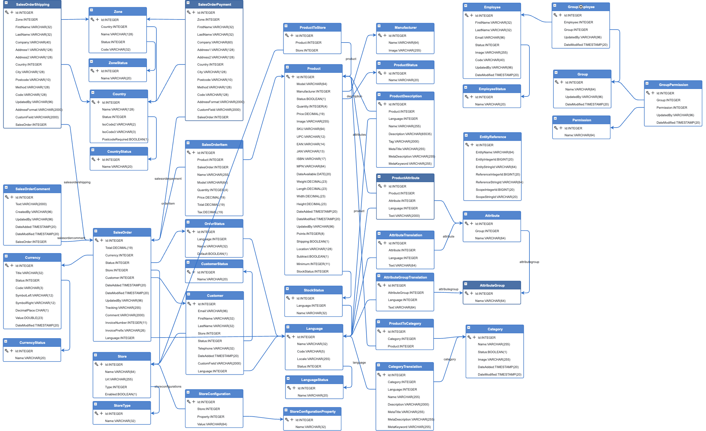
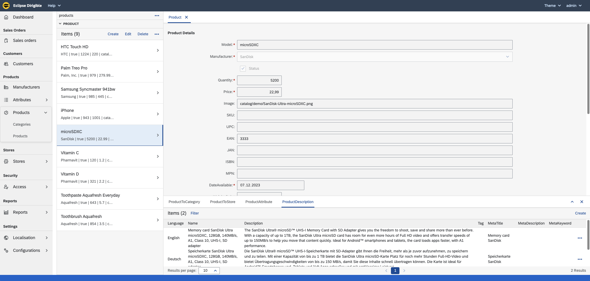
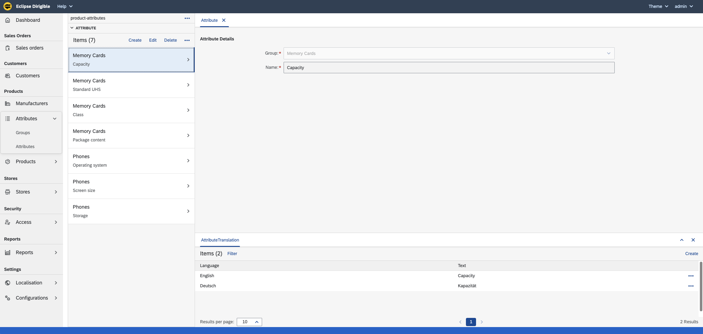

# codbex-electra

e-Commerce Backoffice Management

- [Demo instance](#demo-instance)
- [Build and Run](#build-and-run)
- [Architecture](#architecture)
	- [Design overview](#design-overview)
	- [DB Model](#db-model)
- [User interface](#user-interface)

## Demo instance
You can try the Electra [here](https://dev.electra.eu1.codbex.com). 
It is conifgured to use a [demo OpenCart instance](https://dev.opencart-demo.eu1.codbex.com). 
Details about the configured OpenCart instance could be found [here](https://github.com/codbex/products-documentation/blob/main/opencart/README.md#opencart-303-8).

## Build and Run

### Prerequisites
The following Eclipse Dirigible configurations should be available:

| Name | Example value |
|--|--|
| DIRIGIBLE_HOME_URL | /services/web/codbex-electra/gen/index.html |
| ELECTRA_OPENCART_DB_HOST | localhost |
| ELECTRA_OPENCART_DB_PORT | 3306 |
| ELECTRA_OPENCART_DB_NAME | bitnami_opencart |
| ELECTRA_OPENCART_DB_USER | bn_opencart |
| ELECTRA_OPENCART_DB_PASS | mypass |

[Here](https://www.dirigible.io/help/setup/setup-environment-variables/) is described how you can provide dirigbile configurations.

### Steps
To deploy and run the Electra, you have to follow the steps described bellow.
- Get [Eclipse Dirigible](https://github.com/eclipse/dirigible) up and running by following the steps described in [here](https://github.com/eclipse/dirigible?tab=readme-ov-file#get-started)
- Clone the Electra project `https://github.com/codbex/codbex-electra.git` using the git perspective.
    
    

- Publish the Electra project
    

- After a few seconds, the Electra should be available on the following path `/services/web/codbex-electra/gen/index.html`. If the Dirigible is hosted on `localhost`, the URL will be  [http://localhost:8080/services/web/codbex-electra/gen/index.html](http://localhost:8080/services/web/codbex-electra/gen/index.html)

## Architecture

### Design overview

### DB Model

## User interface

### Launchpad

### Management

#### Sales Orders

#### Products

#### Stores

#### Currencies

#### Employee Groups

#### Employees

#### Manufacturers

#### Customers/Affiliates

#### Attributes

#### Settings

