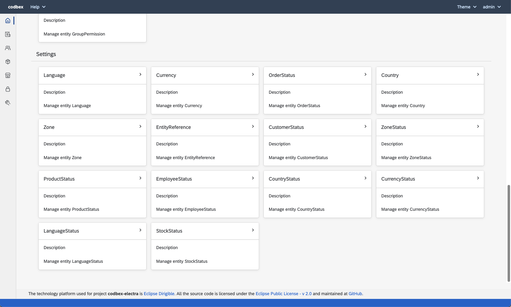

# codbex-electra

e-Commerce Backoffice Management

- [Demo instance](#demo-instance)
- [Build and Run](#build-and-run)
- [Architecture](#architecture)
	- [Design overview](#design-overview)
	- [DB Model](#db-model)
    - [Data synchronization](#data-synchronization)
        - [Inbound synchronization](#inbound-synchronization---data-replication-from-opencart-to-electra)
        - [Outbound synchronization](#outbound-synchronization---data-replication-from-electra-to-opencart)
- [User interface](#user-interface)

## Demo instance
You can try the Electra [here](https://dev.electra.eu1.codbex.com). 
It is conifgured to use a [demo OpenCart instance](https://dev.opencart-demo.eu1.codbex.com). 
Details about the configured OpenCart instance could be found [here](https://github.com/codbex/awesome-stuff/tree/main/opencart#opencart-303-8).

## Build and Run

### Prerequisites
The following Eclipse Dirigible configurations should be available:

| Name | Example value | Description |
|--|--|--|
| DIRIGIBLE_HOME_URL | /services/web/codbex-electra/gen/index.html | Electra home URL |
| ELECTRA_OPENCART_DB_HOST | localhost | OpenCart DB host |
| ELECTRA_OPENCART_DB_PORT | 3306 | OpenCart DB port |
| ELECTRA_OPENCART_DB_NAME | bitnami_opencart | OpenCart DB name |
| ELECTRA_OPENCART_DB_USER | bn_opencart | OpenCart DB user |
| ELECTRA_OPENCART_DB_PASS | mypass | OpenCart DB pass |
| ELECTRA_ECONT_SHOP_SECRET | 6303036@1vDbAJ6LhPPxb9wFsaDWD32eqw | A secret for your shop in deliver with econt   |
| ELECTRA_ECONT_DELIVERY_URL | https://delivery.econt.com | URL of the deliver with econt |

[Here](https://www.dirigible.io/help/setup/setup-environment-variables/) is described how you can provide dirigbile configurations.

### Steps
To deploy and run the Electra, you have to follow the steps described bellow.
- Get [Eclipse Dirigible](https://github.com/eclipse/dirigible) up and running by following the steps described in [here](https://github.com/eclipse/dirigible?tab=readme-ov-file#get-started)
- Clone the Electra project `https://github.com/codbex/codbex-electra.git` using the git perspective.

    

    

- Publish the Electra project

    

- After a few seconds, the Electra should be available on the following path `/services/web/codbex-electra/gen/index.html`. If the Dirigible is hosted on `localhost`, the URL will be  [http://localhost:8080/services/web/codbex-electra/gen/index.html](http://localhost:8080/services/web/codbex-electra/gen/index.html)

## Architecture

### Design overview

---
### DB Model

---
### Data synchronization

#### Inbound synchronization - data replication from OpenCart to Electra
Since OpenCart UI is used by the shop customers to purchase goods, create account and so on, and the products are managed (added, updated, deleted) in the OpenCart admin UI, we have to replicate data from OpenCart to Electra DB. This is done by synchronizers implemented as `*.camel` files which are located [here](codbex-electra-opencart/synch/inbound/). 

In the following table you can find more details about tables mapping.

| OpenCart Table | Electra Table | Synch frequency | Details | Example execution |
|--|--|--|--|--|
| oc_order_product | CODBEX_SALESORDERITEM | every minute | [here](codbex-electra-opencart/synch/inbound/sync-order-items.camel) | 12:00:00 12:01:00 12:02:00 |
| oc_product | CODBEX_PRODUCT | every minute | [here](codbex-electra-opencart/synch/inbound/sync-products.camel) | 12:00:01 12:01:01 12:02:01 |
| oc_manufacturer | CODBEX_MANUFACTURER | every minute | [here](codbex-electra-opencart/synch/inbound/sync-manufacturers.camel) | 12:00:02 12:01:02 12:02:02 |
| oc_order | CODBEX_SALESORDER | every minute | [here](codbex-electra-opencart/synch/inbound/sync-orders.camel) | 12:00:03 12:01:03 12:02:03 |
| oc_order | CODBEX_SALESORDERPAYMENT | every minute | [here](codbex-electra-opencart/synch/inbound/sync-orders.camel) | 12:00:03 12:01:03 12:02:03 |
| oc_order | CODBEX_SALESORDERSHIPPING | every minute | [here](codbex-electra-opencart/synch/inbound/sync-orders.camel) | 12:00:03 12:01:03 12:02:03 |
| oc_customer | CODBEX_CUSTOMER | every minute | [here](codbex-electra-opencart/synch/inbound/sync-customers.camel) | 12:00:04 12:01:04 12:02:04 |
| oc_country | CODBEX_COUNTRY | hourly | [here](codbex-electra-opencart/synch/inbound/sync-countries.camel) | 12:30:00 13:30:00 14:30:00 |
| oc_currency | CODBEX_CURRENCY | hourly | [here](codbex-electra-opencart/synch/inbound/sync-currencies.camel) | 12:30:01 13:30:01 14:30:01 |
| oc_language | CODBEX_LANGUAGE | hourly | [here](codbex-electra-opencart/synch/inbound/sync-languages.camel) | 12:30:02 13:30:02 14:30:02 |
| oc_stock_status | CODBEX_STOCKSTATUS | hourly | [here](codbex-electra-opencart/synch/inbound/sync-stock-statuses.camel) | 12:30:03 13:30:03 14:30:03 |
| oc_store | CODBEX_STORE | hourly | [here](codbex-electra-opencart/synch/inbound/sync-stores.camel) | 12:30:04 13:30:04 14:30:04 |
| oc_zone | CODBEX_ZONE | hourly | [here](codbex-electra-opencart/synch/inbound/sync-zones.camel) | 12:30:05 13:30:05 14:30:05 |
| oc_order_status | CODBEX_SALESORDERITEM | hourly | [here](codbex-electra-opencart/synch/inbound/sync-order-status.camel) | 12:30:06 13:30:06 14:30:06 |

OpenCart DB model could be found [here](https://github.com/opencart/opencart/blob/3.0.3.8/upload/install/opencart.sql).

#### Outbound synchronization - data replication from Electra to OpenCart
Some of the actions which are made in the Electra, must be applied to the OpenCart DB as well. This is done by listeners implemented as `*.listener` files which are located [here](codbex-electra-opencart/synch/outbound/). 

In the following table you can find more details about the actions which have effect in the OpenCart DB as well.

| Electra entity| Action | OpenCart table | Affected Columns | Details |
|--|--|--|--|--|
| Product | update | oc_product | quantity   stock_status_id   status   date_modified | [here](codbex-electra-opencart/synch/outbound/product-handler.mjs)
| SalesOrder | update | oc_order | invoice_no   invoice_prefix   store_id   customer_id   comment   total   order_status_id   tracking, language_id   currency_id   accept_language   date_modified | [here](codbex-electra-opencart/synch/outbound/sales-order-handler.mjs)
| SalesOrder | delete | oc_order | n/a | [here](codbex-electra-opencart/synch/outbound/sales-order-handler.mjs)
| SalesOrderItem | delete | oc_order_product | n/a | [here](codbex-electra-opencart/synch/outbound/sales-order-item-handler.mjs)
| SalesOrderShipping | update | oc_order | shipping_firstname   shipping_lastname   shipping_company   shipping_address_1   shipping_address_2   shipping_city   shipping_postcode   shipping_country_id   shipping_zone_id   shipping_address_format   shipping_custom_field   shipping_method   shipping_code   date_modified | [here](codbex-electra-opencart/synch/outbound/sales-order-shipping-handler.mjs)

## User interface

### Launchpad

### Management

#### Sales Orders

##### Items

##### Shipping

##### Payment

##### Comments
You can add comments to the selected order.

##### Print econt shipping label
You can print an econt shipping label using the `Print Shipping Label` button.

#### Products

#### Stores

#### Currencies

#### Employee Groups

#### Employees

#### Manufacturers

#### Customers/Affiliates

#### Attributes

#### Settings

#### Settings launchpad

